# Documentación asignación PICTET DVP (coordenadas, etc)

En esta sección se ilustra el proceso de configuración de los campos para los distintos tipos de liquidación.

Los tipos de liquidación que existen actualmente en el sistema son: Fed, DTC, Euroclear, Clearstream e International.

## Configuración

Para poder configurar los campos Fed, DTC y Euroclear necesitamos ingresar al apartado de Mantenimiento -\> Instituciones -\> Dar doble clic en alguna institución de la lista

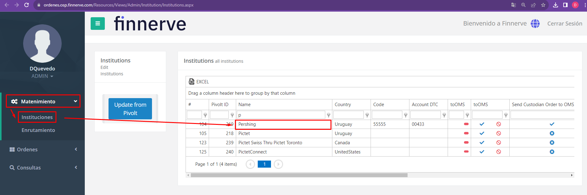

Una vez demos doble clic en una de las instituciones, el sistema nos mostrará los campos de los tipos de liquidación que podemos llenar.

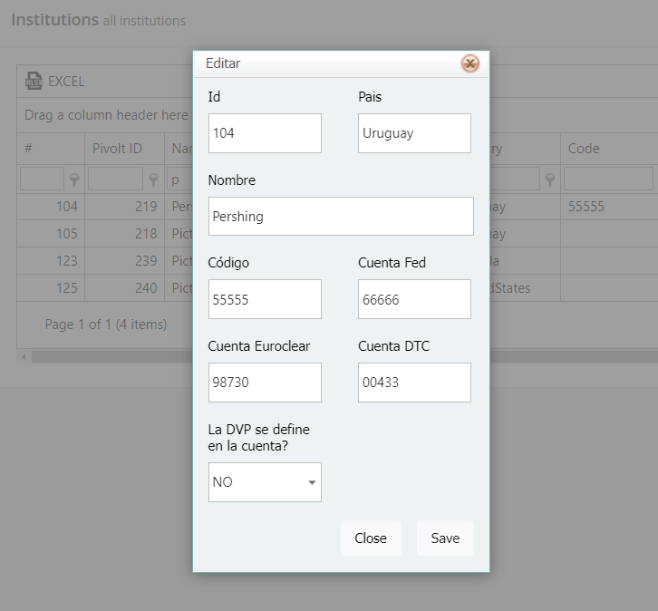

Para este caso completamos los campos de la siguiente manera:

Cuenta Fed: 66666

Cuenta DTC: 00433

Cuenta Euroclear: 98730

Una vez realizado ello le damos en SAVE y vamos a realizar unas pruebas para verificar que los campos se están mostrando correctamente en el formato de envío de asignación.

Esta evaluación se llevará a cabo con una orden consolidadora Fincome conformada por 3 órdenes unitarias y que tenga como Contraparte a CGCO para que pueda enrutar al Broker y seguir su flujo en Broker.

## Cuenta Fed

Seleccionamos y enviamos la orden consolidadora para recibirla en Broker.

Una vez estando en Broker, aceptamos la orden

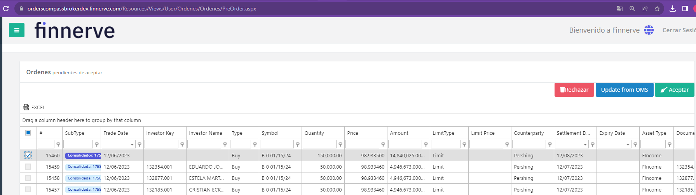

La enviamos

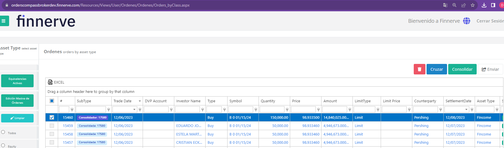

Creamos su confirmación

Para colocar tipo de liquidación Fed, se selecciona la opción “Fed” en el desplegable del campo Settlement type.

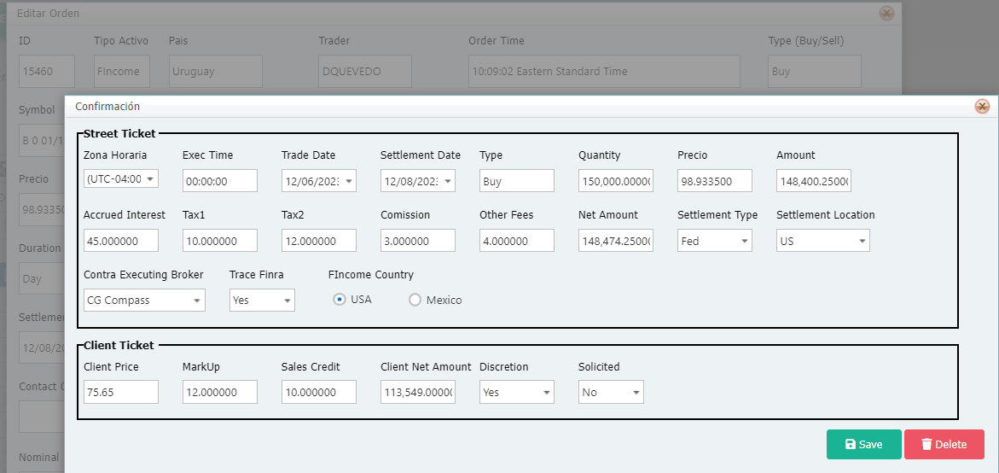

La asignamos

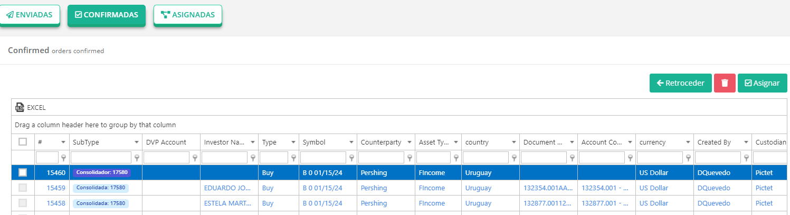

Enviamos el formato de envío de Asignación en Broker

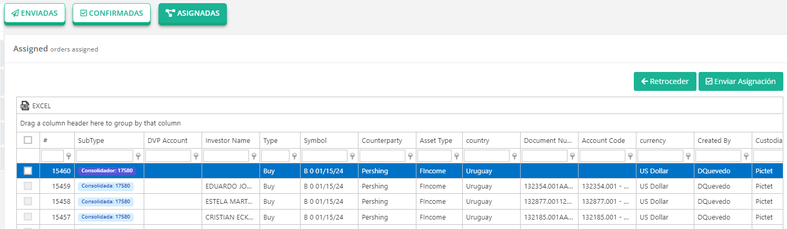

Nos llega el siguiente formato de Pershing:

Si regresamos a OMS Compass veremos que la orden se avanzó hasta Confirmada, procedemos a Asignarla

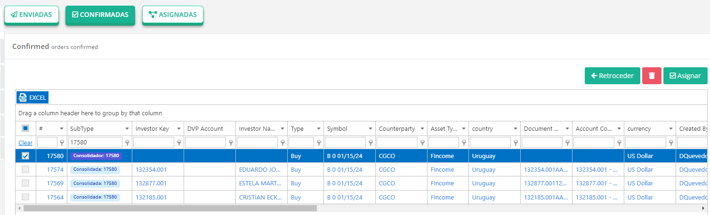

Y por último **enviamos el Formato de envío de Asignación**.

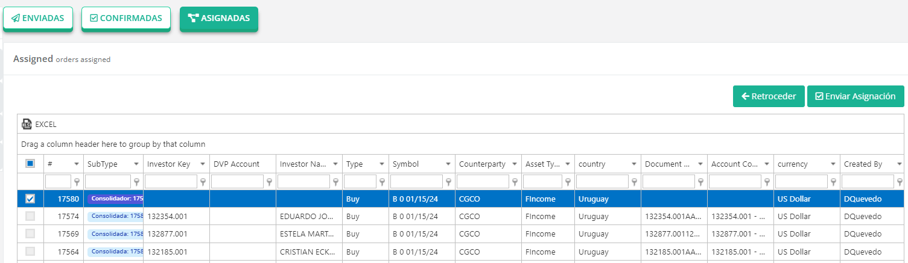

El formato que recibimos es el siguiente y verificamos que el campo se está llenando correctamente.

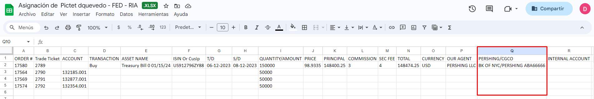

## Cuenta DTC

Seleccionamos y enviamos la orden consolidadora para recibirla en Broker.

Una vez estando en Broker, aceptamos la orden

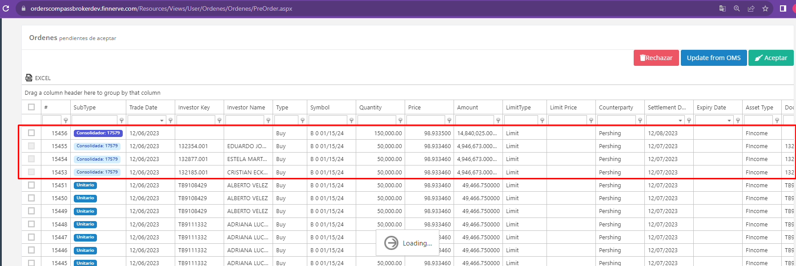

La enviamos y creamos su confirmación

Para colocar tipo de liquidación DTC, se selecciona la opción “DTC” en el desplegable del campo Settlement Type.

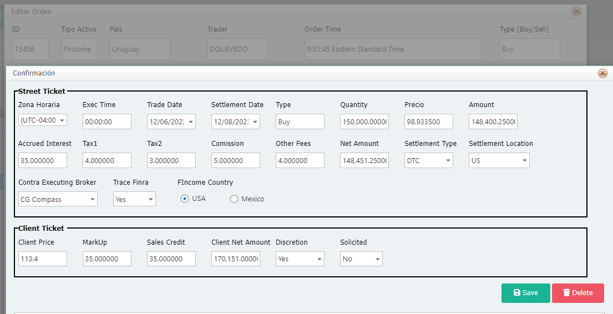

La asignamos

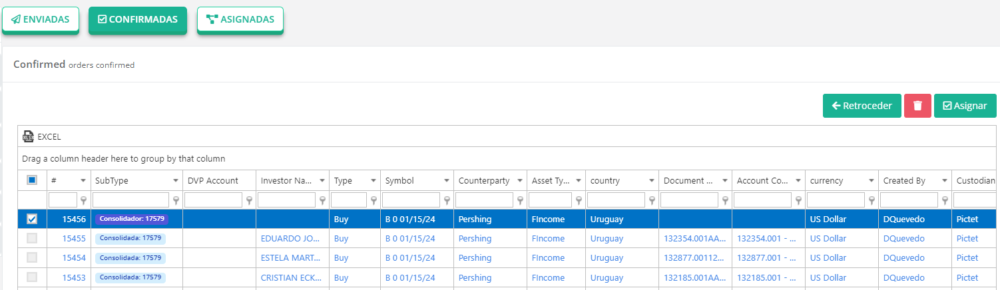

Enviamos el formato de envío de Asignación

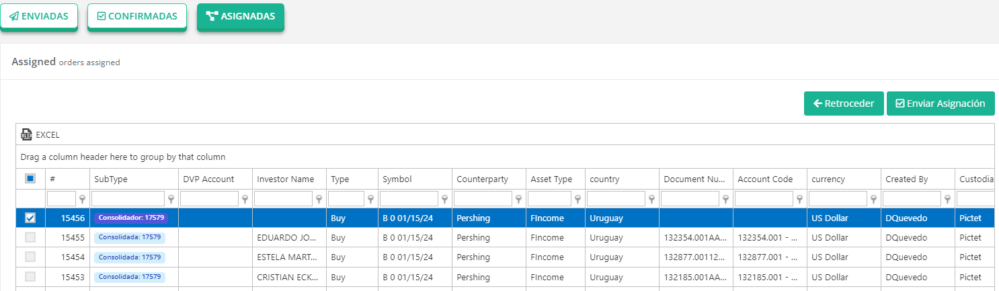

En este caso nos llega el formato de Pershing

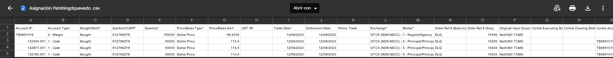

Si regresamos a OMS Compass veremos que la orden se avanzó hasta Confirmada, procedemos a Asignarla

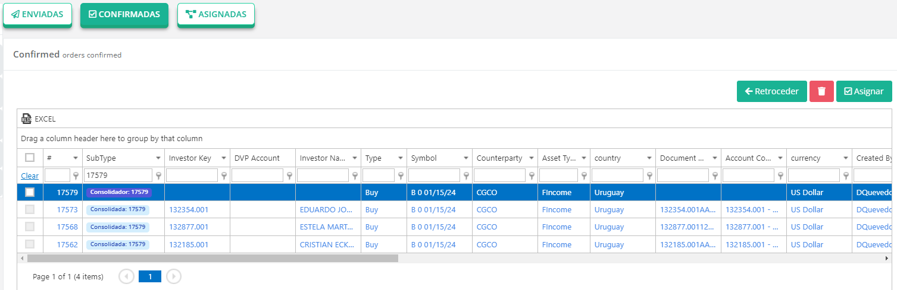

Y por último enviamos el Formato de envío de Asignación.

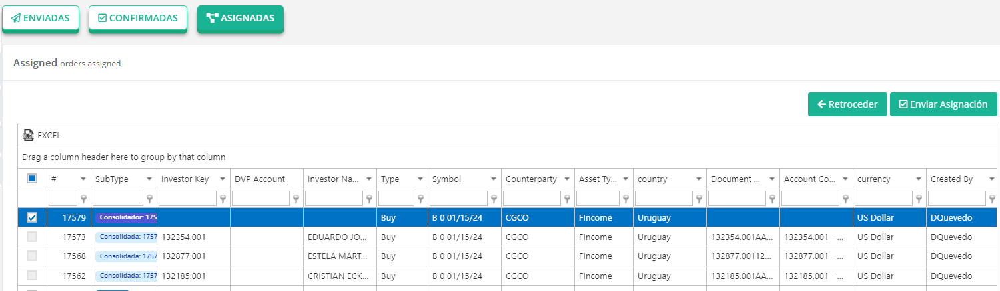

El formato que recibimos es el siguiente y verificamos que el campo se está llenando correctamente.

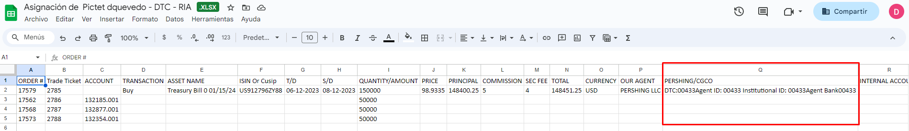

## Cuenta EuroClear

Seleccionamos y enviamos la orden consolidadora para recibirla en Broker.

Una vez estando en Broker, aceptamos la orden

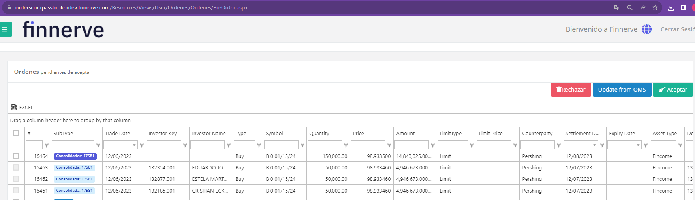

La enviamos

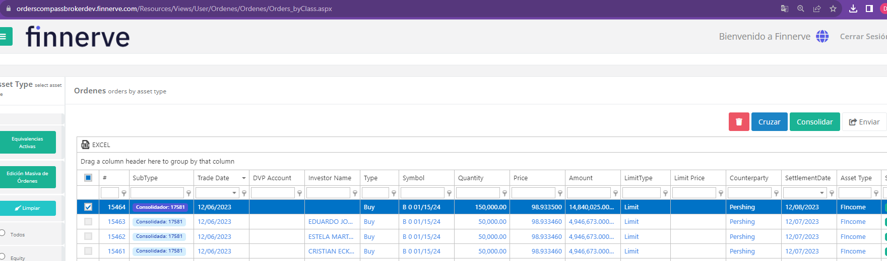

Creamos su confirmación

Para colocar tipo de liquidación Euroclear, se selecciona la opción “EuroClear” en el desplegable del campo Settlement Type.

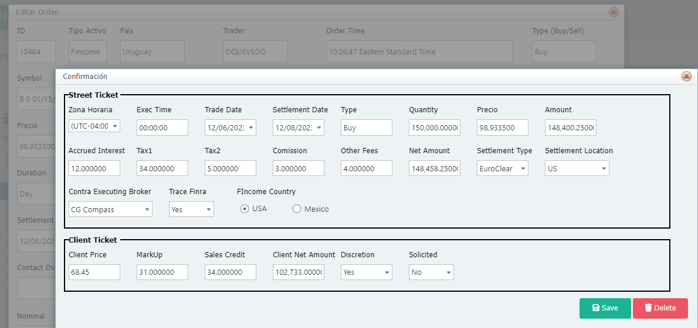

La asignamos

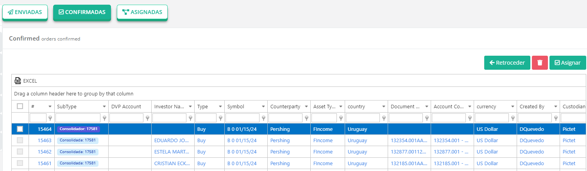

Enviamos el formato de envío de Asignación

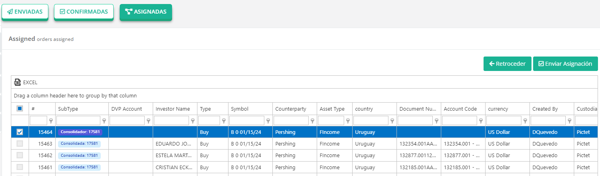

En este caso nos llega el formato de Pershing

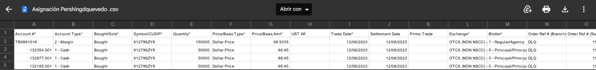

Si regresamos a OMS Compass veremos que la orden se avanzó hasta Confirmada, procedemos a Asignarla

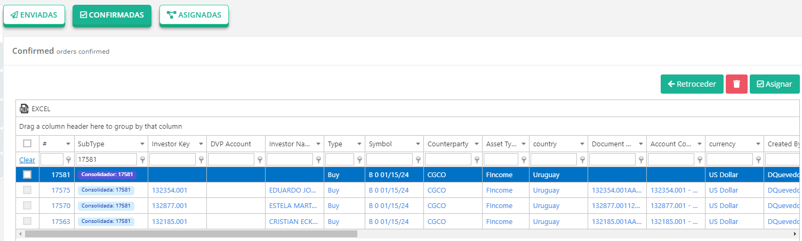

Y por último enviamos el Formato de envío de Asignación.

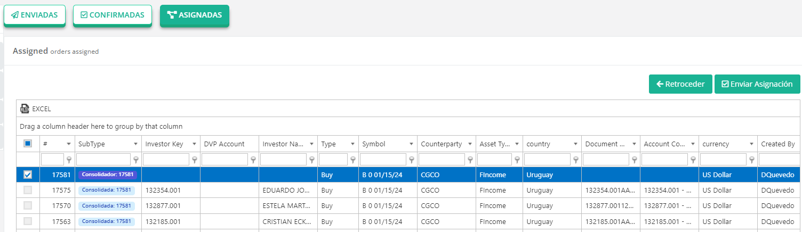

El formato que recibimos es el siguiente y verificamos que el campo se está llenando correctamente.

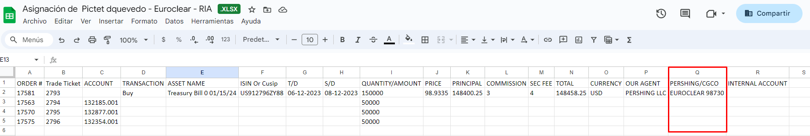
