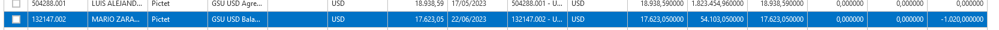
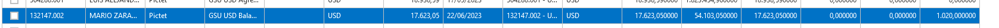
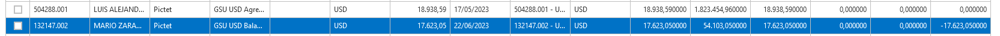

# Generación Masiva de Pre Órdenes

## Introducción

Con el objetivo de mejorar el control y registro de las órdenes generadas en el sistema OMS, se ha solicitado la implementación de una funcionalidad que permita la creación masiva de órdenes, en donde se manejen .

## Alcance

-   Las cuentas que conforman esta etapa están directamente relacionadas con aquellas gestionadas en Pivolt. Por lo tanto, las cuentas que se presentarán para la Generación Masiva estarán vinculadas a los portafolios que el usuario correspondiente puede ver en Pivolt.
-   Las órdenes ingresadas por el RIA, son órdenes que siguen un enrutamiento que se encuentra previamente configurado en el sistema.
-   Las órdenes ingresadas por el Broker, son órdenes que siguen un enrutamiento que se encuentra previamente configurado en el sistema.
-   Los activos y las instituciones (contrapartes) que se manejan en el sistema son aquellas gestionadas en Pivolt.
-   La creación de activos es de responsabilidad de las áreas de Middle Office de los RIAs, con un control exhaustivo por parte de GSU Riesgo para una correcta creación y clasificación.
-   Para los portafolios modelos que siguen una estrategia GSU, la responsabilidad de su creación es de GSU. Mientras que para las estrategias “Tailor Made”, es de responsabilidad de cada asesor su actualización en el sistema.
-   Los límites se encuentran configurados por el área de GSU Riesgo.
-   La integración de los datos entre Salesforce y Pivolt es de responsabilidad de Sistemas Compass.
-   Las posiciones son valorizadas por el equipo de Finix Group de manera diaria, a excepción de Pictet, para el cual se carga la información que envía directamente el custodio (esta integración la realiza Sistemas Compass).
-   La conciliación entre las posiciones de Pivolt y de los respectivos custodios es de responsabilidad de Finix Group.

## Glosario

| RIA          | Ejecutores que registran, enrutan, ingresen al custodio las órdenes de carteras manejadas offshore; para efecto del modelo operacional asociado, se consideran en este rol a las oficinas de: Miami y Uruguay |
|--------------|---------------------------------------------------------------------------------------------------------------------------------------------------------------------------------------------------------------|
| Pre órdenes  | Son solicitudes previas a la generación de las órdenes, estas muestran cómo se verán modificados las cuentas de los inversionistas al ser creada la órden.                                                    |
| Enrutamiento | Proceso por el cuál del sistema de OMS asociará a una órden una contraparte de acuerdo a ciertos criterios que se deben seguir según las rutas ingresadas a OMS.                                              |

## Configuración inicial

### Rutas

Para el correcto enrutamiento de las pre órdenes en el sistema, debe contar con ciertos parámetros que deben ser correctamente llenados en OMS para la creación de la ruta, los cuales son:

| Objeto    | Campo                 | Descripción                                                                                                         |
|-----------|-----------------------|---------------------------------------------------------------------------------------------------------------------|
| **Rutas** | Sociedad del Contrato | País de la sociedad del contrato                                                                                    |
|           | Tipo de Servicio      | Tipo de servicio (discrecional o no discrecional)                                                                   |
|           | Broker Original       | Custodio de la Cuenta es el Broker original el cuál será usado para la nueva ruta                                   |
|           | Tipo del Activo       | Es el tipo del Activo que se analizará para la ruta. Este puede ser Equity, Fincome, Fund, Option, Future o Divisa. |
|           | País del Activo       | País asociado al Activo.*.*                                                                                         |
|           | Mayor o Igual a       | Límite a ser cumplido dónde el monto de la cuenta debe ser mayor o igual a cierto número*.*                         |
|           | Menor a               | Límite a ser cumplido dónde el monto de la cuenta debe ser menor a cierto número.                                   |
|           | Broker Destino        | El resultado del enrutamiento. Será la contraparte a la que será enviada la órden.                                  |
|           | Cuenta DVP            | Cuenta DVP (Entrega contra pago) asociada a la ruta resultante.                                                     |

Campos relevantes por objetos, asociados a la ruta en OMS.

| Objeto                  | Valores                                       | Comportamiento             |
|-------------------------|-----------------------------------------------|----------------------------|
| Account Manager Country | Lista de países                               | Se carga desde integración |
| Discretional            | SI/NO                                         | Se carga desde integración |
| Broker From             | Instituciones de Pivolt                       | Se carga desde integración |
| Asset Type              | Equity/ Fincome/ Fund/ Option/ Future/ Divisa | Se carga desde integración |
| Asset Country           | Lista de países                               | Se carga desde integración |
| Broker To               | Instituciones de Pivolt                       | Se carga desde integración |

Esta información se verá plasmada en la grilla de rutas.

### Definiciones de activos

**Equity:**

Para el cálculo del campo Amount de este tipo de activo, se toma en cuenta el Price y el Quantity.

Amount = Price \* Quantity

NOTA:

Para el caso de generar y consolidar una orden de tipo *Equity* que tenga Broker de México, a la orden consolidadora se le agrega en el precio el 1% del precio original. Las hijas u órdenes consolidadas mantienen el precio original.

**FIconme:**

Para el cálculo del campo Amount de este tipo de activo, se toma en cuenta el Price, Quantity, FactorPrice y el Nominal.

Amount = Price \* Quantity\*Nominal\* FactorPrice

**Option:**

Para el cálculo del campo Amount se toma en cuenta el ContractSize, Quantity y el Price.

Amount=ContractSize\*Quantity\*Price

**Fund:**

Para el cálculo del campo Amount de este tipo de activo, se toma en cuenta el Price y el Quantity. Tener el cuenta que para este caso el Quantity admite decimal.

Amount = Price \* Quantity

## Caja - Generación Masiva de Pre Órdenes

### Actualización de la Caja

Ir al menú Órdenes 🡪 Generación Masiva de Órdenes 🡪 Caja.

Objetivo: Actualizar Caja con los últimos cambios de Pivolt y OMS.

Grilla para poder visualizar el estado actual de las cuentas de los inversionistas. Cada vez que sea posible seleccionar el botón de “Actualizar Caja” para actualizar las cuentas con los últimos cambios realizados.

-   Luego de presionar el botón “Actualizar Caja” debe aparecer un mensaje de “Caja Actualizada”

Detalle de la información de la cuenta. D0, D1, D2 y DN se ven alterados de acuerdo a las fechas de liquidación de las órdenes generadas.

Para mover las columnas, debes seleccionar la cabecera y arrastrarla entre 2 columnas.

Ej: Para mover columna “Currency Account”, seleccionar y moverla hasta las columnas “Investor Currency” y “Cash in Account Manager”

### Generación Masiva de Pre Órdenes

Ir al menú Órdenes 🡪 Generación Masiva de Órdenes 🡪 Caja.

Objetivo: Crear pre órdenes de forma masiva con varias cuentas.

#### Ingreso de pre órdenes masivas

| Campo                          | *Descripción*                                                                                                                                     | *Valores*                                                   |
|--------------------------------|---------------------------------------------------------------------------------------------------------------------------------------------------|-------------------------------------------------------------|
| Transaction Type               | Tipo de transacción de la órden. Puede ser una compra, venta o compra/venta (llevar la caja a 0).                                                 | *Lista desplegable*                                         |
| Brokers                        | Es la contraparte que será usada para efectos de enrutamiento. Caso se deje vacío se usará el custodio de las cuentas                             | Lista desplegable y/o digitar                               |
| Asset                          | Es el activo de la pre órden                                                                                                                      | Lista desplegable y/o digitar                               |
| Precio Market                  | Es el precio del activo según el valor actual en el mercado. Puede ser modificado                                                                 | Valor numérico                                              |
| Ingresar por                   | Maneja cómo es que se deberá procesar las nuevas pre órdenes (por cantidad, por monto o por porcentaje establecido).                              | *Lista desplegable*: Cantidad Monto % Caja % NAV % Posición |
| Monto/ Cantidad/ Tasa          | Número correspondiente para el cálculo del monto final de la órden, y la cantidad solicitada. Va de acorde a lo seleccionado en el ítem anterior. | Valor numérico                                              |
| Distribuible o no Distribuible | Se debe seleccionar si el monto anterior va a ser distribuido entre las cuentas.                                                                  | Botón de selección                                          |
| Order Type                     | Se debe seleccionar si la orden será de tipo Market, Stop o Limit (tipo de ejecución)                                                             | *Lista desplegable* Mercado Limit  Stop                     |
| Precio Stop/ Limit             | Es el monto correspondiente si es de tipo Stop o Limit.                                                                                           | Valor numérico                                              |
| Tipo de Envío                  | Es el tipo de envío                                                                                                                               | *Lista desplegable* Cantidad Monto                          |
| Observación                    | Ingresar la nota asociada que se va a generar.                                                                                                    | Texto                                                       |

-   Luego de presionar el botón “Guardar” debe aparecer un mensaje de “Guardado”.

Debe cerrarse y mostrar la pantalla anterior con un mensaje “Guardado”. Dependiendo de las cuentas seleccionadas, los valores de DO, D1, D2 y DN se van actualizando de acuerdo a las fechas de liquidación de cada una de las pre órdenes generadas

### Generación Unitaria de Pre Órdenes

Ir al menú Órdenes 🡪 Generación Masiva de Órdenes 🡪 Caja.

Objetivo: Crear pre órdenes con una cuenta.

#### Ingreso de pre órden unitaria

| Campo                 | *Descripción*                                                                                                                                     | *Valores*                                                   |
|-----------------------|---------------------------------------------------------------------------------------------------------------------------------------------------|-------------------------------------------------------------|
| Transaction Type      | Tipo de transacción de la órden. Puede ser una compra, venta o compra/venta (llevar la caja a 0).                                                 | *Lista desplegable*                                         |
| Broker                | Es la contraparte que será usada para efectos de enrutamiento. Caso se deje vacío se usará el custodio de las cuentas                             | Lista desplegable y/o digitar                               |
| Asset                 | Es el activo de la pre órden                                                                                                                      | Lista desplegable y/o digitar                               |
| Ingresar por          | Maneja cómo es que se deberá procesar las nuevas pre órdenes (por cantidad, por monto o por porcentaje establecido).                              | *Lista desplegable*: Cantidad Monto % Caja % NAV % Posición |
| Monto/ Cantidad/ Tasa | Número correspondiente para el cálculo del monto final de la órden, y la cantidad solicitada. Va de acorde a lo seleccionado en el ítem anterior. | Valor numérico                                              |
| Order Type            | Se debe seleccionar si la orden será de tipo Market, Stop o Limit (tipo de ejecución)                                                             | *Lista desplegable* Mercado Limit  Stop                     |
| Precio Stop/ Limit    | Es el monto correspondiente si es de tipo Stop o Limit.                                                                                           | Valor numérico                                              |
| Tipo de Envío         | Es el tipo de envío                                                                                                                               | *Lista desplegable* Cantidad Monto                          |
| Precio Market         | Es el precio del activo según el valor actual en el mercado. Puede ser modificado                                                                 | Valor numérico                                              |
| Observación           | Ingresar la nota asociada que se va a generar.                                                                                                    | Texto                                                       |

-   Luego de presionar el botón “Guardar” debe aparecer un mensaje de “Guardado”.

Debe cerrarse y mostrar la pantalla anterior con un mensaje “Guardado”. Dependiendo de las cuentas seleccionadas, los valores de DO, D1, D2 y DN se van actualizando de acuerdo a las fechas de liquidación de la pre órden generada

### Enrutamiento

Luego del registro de las nuevas pre órdenes, van a seguir las reglas de enrutamiento establecidas de acuerdo al broker seleccionado en el formulario anterior o, por su defecto, el custodio de la cuenta.

Ej: En la tabla de rutas, si tenemos que para el caso de:

-   Tipo de Servicio: Discrecional
-   Broker de Origen: Pictet
-   Tipo de Activo: Equity
-   País del Activo: Estados Unidos

Y un monto mayor a 33,400 USD, entonces se enviará a CGCO, caso contrario, a Pictet.

Por lo tanto, si tenemos la pre órden que tienen como Broker a Pictet, con el activo seleccionado de tipo Equity cuyo país es Estados Unidos, la cuenta de los inversionistas es de Uruguay y el tipo de servicio es discrecional. Entonces el sistema evaluará las rutas para la pre órden a ser creada, si su monto sobrepasa los 33,400 USD entonces todas estas pre órdenes van a ser enviadas a CGCO. Caso contrario, se enviarán a Pictet.

## Posiciones - Generación Masiva de Pre Órdenes

### Actualización de los Activos

Ir al menú Órdenes 🡪 Generación Masiva de Órdenes 🡪 Posiciones.

Objetivo: Actualizar Activos con los últimos cambios de Pivolt.

Grilla para poder visualizar, según un activo seleccionado, el estado de la cuenta de los inversionistas que tengan dicho activo en posición de sus portafolios. Cada vez que sea posible seleccionar el botón de “Actualizar Activo” para actualizar los activos con los últimos cambios realizados en Pivolt.

-   Luego de presionar el botón “Actualizar Activos” debe aparecer un mensaje de “Activos Actualizados”.

#### Búsqueda de activos

La búsqueda del activo mostrará todas las cuentas de los inversionistas que tengan al activo en posición.

### Generación Masiva de Pre Órdenes

Ir al menú Órdenes 🡪 Generación Masiva de Órdenes 🡪 Posiciones.

Objetivo: Crear pre órdenes de forma masiva con varias cuentas.

#### Ingreso de pre órdenes masivas

| Campo                          | *Descripción*                                                                                                                                     | *Valores*                                                   |
|--------------------------------|---------------------------------------------------------------------------------------------------------------------------------------------------|-------------------------------------------------------------|
| Transaction Type               | Tipo de transacción de la órden. Puede ser una compra, venta o compra/venta (llevar la caja a 0).                                                 | *Lista desplegable*                                         |
| Brokers                        | Es la contraparte que será usada para efectos de enrutamiento. Caso se deje vacío se usará el custodio de las cuentas                             | Lista desplegable y/o digitar                               |
| Asset                          | Es el activo de la pre órden                                                                                                                      | Lista desplegable y/o digitar                               |
| Precio Market                  | Es el precio del activo según el valor actual en el mercado. Puede ser modificado                                                                 | Valor numérico                                              |
| Ingresar por                   | Maneja cómo es que se deberá procesar las nuevas pre órdenes (por cantidad, por monto o por porcentaje establecido).                              | *Lista desplegable*: Cantidad Monto % Caja % NAV % Posición |
| Monto/ Cantidad/ Tasa          | Número correspondiente para el cálculo del monto final de la órden, y la cantidad solicitada. Va de acorde a lo seleccionado en el ítem anterior. | Valor numérico                                              |
| Distribuible o no Distribuible | Se debe seleccionar si el monto anterior va a ser distribuido entre las cuentas.                                                                  | Botón de selección                                          |
| Order Type                     | Se debe seleccionar si la orden será de tipo Market, Stop o Limit (tipo de ejecución)                                                             | *Lista desplegable* Mercado Limit  Stop                     |
| Precio Stop/ Limit             | Es el monto correspondiente si es de tipo Stop o Limit.                                                                                           | Valor numérico                                              |
| Tipo de Envío                  | Es el tipo de envío                                                                                                                               | *Lista desplegable* Cantidad Monto                          |
| Observación                    | Ingresar la nota asociada que se va a generar.                                                                                                    | Texto                                                       |

-   Luego de presionar el botón “Guardar” debe aparecer un mensaje de “Guardado”.

Regresando a la pantalla de caja Dependiendo de las cuentas seleccionadas, los valores de DO, D1, D2 y DN se van actualizando de acuerdo a las fechas de liquidación de cada una de las pre órdenes generadas.

### Generación Unitaria de Pre Órdenes

Ir al menú Órdenes 🡪 Generación Masiva de Órdenes 🡪 Caja.

Objetivo: Crear pre órdenes con una cuenta.

#### Ingreso de pre órden unitaria

| Campo                 | *Descripción*                                                                                                                                     | *Valores*                                                   |
|-----------------------|---------------------------------------------------------------------------------------------------------------------------------------------------|-------------------------------------------------------------|
| Transaction Type      | Tipo de transacción de la órden. Puede ser una compra, venta o compra/venta (llevar la caja a 0).                                                 | *Lista desplegable*                                         |
| Broker                | Es la contraparte que será usada para efectos de enrutamiento. Caso se deje vacío se usará el custodio de las cuentas                             | Lista desplegable y/o digitar                               |
| Asset                 | Es el activo de la pre órden                                                                                                                      | Lista desplegable y/o digitar                               |
| Ingresar por          | Maneja cómo es que se deberá procesar las nuevas pre órdenes (por cantidad, por monto o por porcentaje establecido).                              | *Lista desplegable*: Cantidad Monto % Caja % NAV % Posición |
| Monto/ Cantidad/ Tasa | Número correspondiente para el cálculo del monto final de la órden, y la cantidad solicitada. Va de acorde a lo seleccionado en el ítem anterior. | Valor numérico                                              |
| Order Type            | Se debe seleccionar si la orden será de tipo Market, Stop o Limit (tipo de ejecución)                                                             | *Lista desplegable* Mercado Limit  Stop                     |
| Precio Stop/ Limit    | Es el monto correspondiente si es de tipo Stop o Limit.                                                                                           | Valor numérico                                              |
| Tipo de Envío         | Es el tipo de envío                                                                                                                               | *Lista desplegable* Cantidad Monto                          |
| Precio Market         | Es el precio del activo según el valor actual en el mercado. Puede ser modificado                                                                 | Valor numérico                                              |
| Observación           | Ingresar la nota asociada que se va a generar.                                                                                                    | Texto                                                       |

-   Luego de presionar el botón “Guardar” debe aparecer un mensaje de “Guardado”.

Regresando a la pantalla de caja. Dependiendo de la cuenta seleccionada para la pre órden, los valores de DO, D1, D2 y DN se van actualizando de acuerdo a las fechas de liquidación. ****

# 

### Enrutamiento

Luego del registro de las nuevas pre órdenes, van a seguir las reglas de enrutamiento establecidas de acuerdo al broker seleccionado en el formulario anterior o, por su defecto, el custodio de la cuenta.

Ej: En la tabla de rutas, si tenemos que para el caso de:

-   Tipo de Servicio: Discrecional
-   Broker de Origen: Pictet
-   Tipo de Activo: Equity
-   País del Activo: Estados Unidos

Y un monto mayor a 33,400 USD, entonces se enviará a CGCO, caso contrario, a Pictet.

Por lo tanto, si tenemos la pre órden que tienen como Broker a Pictet, con el activo seleccionado de tipo Equity cuyo país es Estados Unidos, la cuenta de los inversionistas es de Uruguay y el tipo de servicio es discrecional. Entonces el sistema evaluará las rutas para la pre órden a ser creada, si su monto sobrepasa los 33,400 USD entonces todas estas pre órdenes van a ser enviadas a CGCO. Caso contrario, se enviarán a Pictet.

## Generación Masiva de Órdenes

### Consulta de Pre Órdenes

Ir a la pantalla Órdenes -\> Generación Masiva de Órdenes -\> Pre Órdenes.

Objetivo: Visualizar las pre órdenes creadas.

### Edición Masiva de Pre Órdenes

Ir a la pantalla Órdenes -\> Generación Masiva de Órdenes -\> Pre Órdenes.

Objetivo: Editar masivamente las pre órdenes antes de su envío.

Ingreso de edición pre órdenes masivas

| Campo             | *Descripción*                                                                                                                                                                                                                                                                                                                                                                                                                                                                                                                                                         | *Valores*                                        |
|-------------------|-----------------------------------------------------------------------------------------------------------------------------------------------------------------------------------------------------------------------------------------------------------------------------------------------------------------------------------------------------------------------------------------------------------------------------------------------------------------------------------------------------------------------------------------------------------------------|--------------------------------------------------|
| Cantidad          | Ingresar la cantidad total de las pre órdenes, este modificará el valor de todas las pre órdenes a la nueva cantidad. Por lo tanto, va a generar un nuevo monto, teniendo en cuenta el valor del Precio ya establecido para cada activo o del precio modificado junto con la cantidad. El nuevo monto se mostrará en el tercer campo (Este nuevo valor generado para todas las pre ordenes se puede mostrar distinto en la grilla de preordenes dependiendo del activo como por ejemplo para los Fincome que considera en su cálculo factores de precio y nominales). | Valor numérico                                   |
| Precio            | Ingresar el precio total de las pre órdenes, este modificará el precio asociado al activo. Por lo tanto, va a generar un nuevo monto, teniendo en cuenta el valor de la cantidad ya establecida para cada activo o de la cantidad modificada junto con el precio. El nuevo monto se mostrará en el tercer campo (Este nuevo valor generado para todas las pre ordenes se puede mostrar distinto en la grilla de preordenes dependiendo del activo como por ejemplo para los Fincome que considera en su cálculo factores de precio y nominales).                      | Valor numérico                                   |
| Monto             | Ingresar el monto de las pre órdenes. De acuerdo al nuevo valor, se modificará la cantidad y el precio.                                                                                                                                                                                                                                                                                                                                                                                                                                                               | Valor numérico                                   |
| Broker            | Es la contraparte que será usada para efectos de enrutamiento. Si no se llena, se usará el custodio de las cuentas. Cambiar la Contraparte va a sobreescribir el campo de “Settlement Date”.                                                                                                                                                                                                                                                                                                                                                                          | Lista desplegable y/o digitar                    |
| Settlement Date   | Es la nueva fecha en donde la pre órden va a liquidar.                                                                                                                                                                                                                                                                                                                                                                                                                                                                                                                | Fecha                                            |
| Tipo de Envío     | Seleccionar el tipo de envío de la futura órden                                                                                                                                                                                                                                                                                                                                                                                                                                                                                                                       | *Lista desplegable* Importe Títulos Subscripción |
| Tipo de ejecución | Seleccionar el tipo de ejecución de la futura órden.                                                                                                                                                                                                                                                                                                                                                                                                                                                                                                                  | *Lista desplegable* Market Limit Stop            |
| Limit Price       | Si es de tipo Stop o Limit, ingresar el monto correspondiente.                                                                                                                                                                                                                                                                                                                                                                                                                                                                                                        | Valor numérico                                   |

-   Luego de presionar el botón “Guardar” debe aparecer un mensaje de “Guardado”.

Regresando a la pantalla de caja. Dependiendo de la cuenta seleccionada para la pre órden, los valores de DO, D1, D2 y DN se van actualizando de acuerdo a las fechas de liquidación.

### Edición Unitaria de Pre Órden

Ir a la pantalla Órdenes -\> Generación Masiva de Órdenes -\> Pre Órdenes.

Objetivo: Editar masivamente las pre órdenes antes de su envío.

#### Ingreso de edición de pre órden

| Campo             | *Descripción*                                                                                                                                                                                                                                                                                              | *Valores*                                        |
|-------------------|------------------------------------------------------------------------------------------------------------------------------------------------------------------------------------------------------------------------------------------------------------------------------------------------------------|--------------------------------------------------|
| Cantidad          | Ingresar la cantidad total de la pre órden, este modificará el valor de la pre orden seleccionada a la nueva cantidad. Por lo tanto, va a generar un nuevo monto, teniendo en cuenta el valor del Precio ya establecido o modificado junto con la cantidad. El nuevo monto se mostrará en el tercer campo. | Valor numérico                                   |
| Precio            | Ingresar el precio total de la pre órden, este modificará el precio asociado al activo. Por lo tanto se generará un nuevo monto de acuerdo a la cantidad establecida. El nuevo monto se mostrará en el tercer campo.                                                                                       | Valor numérico                                   |
| Monto             | Ingresar el monto de la pre orden. De acuerdo al nuevo valor ingresado se modificará el valor del campo Cantidad, teniendo en cuenta el precio establecido.                                                                                                                                                | Valor numérico                                   |
| Broker            | Es la contraparte que será usada para efectos de enrutamiento. Si no se llena, se usará el custodio de las cuentas. Cambiar la Contraparte va a sobreescribir el campo de “Settlement Date”.                                                                                                               | Lista desplegable y/o digitar                    |
| Settlement Date   | Es la nueva fecha en donde la pre órden va a liquidar.                                                                                                                                                                                                                                                     | Fecha                                            |
| Tipo de Envío     | Seleccionar el tipo de envío de la futura órden                                                                                                                                                                                                                                                            | *Lista desplegable* Importe Títulos Subscripción |
| Tipo de ejecución | Seleccionar el tipo de ejecución de la futura órden.                                                                                                                                                                                                                                                       | *Lista desplegable* Market Limit Stop            |
| Limit Price       | Si es de tipo Stop o Limit, ingresar el monto correspondiente.                                                                                                                                                                                                                                             | Valor numérico                                   |

-   Luego de presionar el botón “Guardar” debe aparecer un mensaje de “Guardado”.

Regresando a la pantalla de caja. Dependiendo de la cuenta seleccionada para la pre órden, los valores de DO, D1, D2 y DN se van actualizando de acuerdo a las fechas de liquidación.

### Generación Masiva de Órdenes

Ir a la pantalla Órdenes -\> Generación Masiva de Órdenes -\> Pre Órdenes.

Objetivo: Generar las órdenes.

#### Confirmación

En caso no se seleccionen todas las órdenes, se mostrará una pantalla de confirmación.

Finalmente serán generadas las órdenes y serán enviadas a los sistemas correspondientes.

### Envío de órdenes

Generada las pre órdenes y modificadas de acuerdo a las necesidades. Las **órdenes serán enviadas automáticamente** en dos sistemas.

-   Cuando las órdenes tienen como contraparte a CGCO se **enviará a OMS Broker** para su respectiva aprobación.
-   Cuando las órdenes no tienen como contraparte a CGCO se **enviará a OMS Ria**, en la pantalla de Cruzar / Consolidar Órdenes.

En cualquiera de las situaciones, todas las órdenes podrán ser consultadas.

Ir a la pantalla Órdenes -\> Generación Masiva de Órdenes -\> Pre Órdenes

#### Envío a OMS Ria

Ir a la pantalla Órdenes -\> Cruzar / Consolidar/ Enviar Órdenes

#### Envío a OMS Broker

Ir a la pantalla Órdenes -\> Aprobar Órdenes

## Generación Masiva de Pre-Ordenes con distintos activos seleccionados

El equipo de Compass ha solicitado que se pueda buscar activos por Portafolio. La finalidad de esta implementación es acotar la búsqueda de portafolios al momento de generar Pre-ordenes de manera masiva.

### Principales Cambios

#### Modal de Edición Masiva de Orden:

-   Se mantienen todos los campos que existían previamente pero ahora la lista de activos es un desplegable en el cual se puede buscar y seleccionar el activo que se desee y agregar en la grid que se muestra a continuación.

-   Se ha agregado el campo Market Price al momento que se le da clic en el icono de editar de los activos seleccionados para así poder modificar el precio de los mismos.

-   Se agrego una lista desplegable para el tipo de distribución de los activos:

    Tipos de distribución:

    **Distribuible por Posición**: Es una nueva funcionalidad. Esta forma de distribución se usa para generar liquidez en un portafolio vendiendo o comprando varios activos proporcional a las cantidades o montos en posicion de los activos seleccionados.

    **Distribuible por NAV:** Para el caso de Compra la distribución se hace proporcional al monto(campo D0) de cada portafolio. Para el caso de Venta se agrupa por activo y se distribuye proporcionalmente a las cantidades o montos en posicion de los activos seleccionados para los portafolios seleccionados.

    **No distribuible:** Permite generar órdenes con un monto y cantidad fijo para todos y cada uno de los activos seleccionados.

\-Para el caso en que un activo que se quiera agregar para la edición Masiva de Orden, no tenga un precio actual, esto quiere decir, si el último precio registrado para este activo es de hace más de 190 días, se mostrará un mensaje y no se permitirá generar la preorden

#### Vista de Posiciones:

-   En esta vista también se ha agregado una grid para poder visualizar los activos seleccionados y una vez realizada la búsqueda nos mostrará todas las carteras con los activos en posición.

-   Mismo caso con la búsqueda de Portafolios

-   Si buscamos por ambos tipos de búsqueda, es decir, búsqueda por Activos y búsqueda por Portafolios, el sistema hará un cruce entre los activos y portafolios que tienen posición.

#### Vistas en general

**Edición unitaria de transacción:**

-   Se mantiene sin cambios y se puede generar una Pre-orden cuando ya se tiene un resultado de búsqueda y selección masiva de portafolios.

**Edición en la Vista de Pre-ordenes:**

-   Se mantiene la edición de las Pre-órdenes de manera masiva o de manera unitaria

Cuando se edite de manera masiva, solo se guardaran los campos que hallan sido actualizados en el modal de Edición Masiva de Pre-ordenes, es decir, los demás campos se mantienen tal cual como fueron generados.

### Pestaña de Caja - Enrutamiento Agrupado y Cambiando el Precio de Mercado al Fund

Para la prueba de la Generación Masiva en Caja, se va a realizar con la creación de los activos desde cero. No habrá algún traslado de los activos seleccionados de una pantalla a otra. Esto se mostrará y entenderá mejor en la pantalla de Posiciones

#### Compra

Las pruebas se van a hacer con estas 4 Cuentas en la Caja

##### Generación Masiva por Cantidad con 1 Equity, 1 Fund y 1 Renta Fija

#### 

Vemos cómo se generan las Pre-ordenes.

Finalmente, revisamos que se actualizaron los valores de la Caja. Los valores de DO, D1, D2 y DN se van actualizando de acuerdo a las fechas de liquidación de cada una de las pre órdenes generadas.

##### Generación Masiva por Monto no Distribuible con 1 Equity, 1 Fund y 1 Renta Fija.

Para este caso, vamos a editar el precio del Fondo NIGIHUX a un valor de 25. El monto no distribuible significa que todas y cada una de las Preordenes se crearán con el monto o cantidad que se le asigne al momento de la generación masiva de Preórdenes.

Al darle clic al botón de Generar Pre-ordenes

Podremos revisar las realidades de las Pre-ordenes.

Finalmente, revisamos los valores de la Caja.

##### Generación Masiva por Monto Distribuible Por Posición

El modo Distribuible por Posición, a diferencia del no distribuible, significa que el monto o cantidad será distribuido entre todas las Preordenes de forma proporcional a sus posiciones en la que se encuentran al momento de la generación masiva de Preórdenes. En este caso se distribuye el monto.

###### -Generar preordenes del mismo activo para diferentes portafolios

Al darle clic al botón de Generar Pre-ordenes

Posiciones del activo para cada portafolio antes de generar las preordenes.

### 

Al ser de diferentes portafolios se distribuye el monto colocado(10000) para cada preorden.

Podremos revisar las realidades de las Pre-ordenes.

###### -Generar preordenes de activos FIncome, Fund, Equity y Option para diferentes portafolios

Al darle clic al botón de Generar Pre-ordenes

Posiciones de los activos para cada portafolio antes de generar las preordenes.

Se distribuye el monto colocado(20000) para los activos de cada portafolio. En este caso se tiene 3 portafolios a los cuales se le va a distribuir este monto de acuerdo a los montos en posición de sus activos.

Podremos revisar las realidades de las Pre-ordenes.

****

##### Generación Masiva por Monto Distribuible Por NAV

Para el caso de Compra la distribución se hace proporcional al monto(campo D0) de cada portafolio.

###### - Generar preordenes de diferentes activos

Para este caso, no se puede generar preordenes de distintos activos.

###### - Generar preordenes del mismo activo

Se distribuye el monto de 50000 entre las 4 preordenes que son del mismo activo y de acuerdo a los D0 de cada portafolio:

##### Generación Masiva por %Caja 1 Equity, 1 Fund y 1 Renta Fija.

El %Caja es el saldo disponible que tiene el inversionista. En este caso si se ingresa 10% Caja, se realizará la compra de ese activo con un monto del 10% de la caja disponible del inversionista.

Al darle clic al botón de Generar Pre-ordenes

Podremos revisar las realidades de las Pre-ordenes.

Finalmente, revisamos los valores de la Caja.

##### Generación Masiva por %NAV 1 Equity, 1 Fund y 1 Renta Fija.

Al darle clic al botón de Generar Pre-ordenes

Podremos revisar las realidades de las Pre-ordenes.

Finalmente, revisamos los valores de la Caja.

##### Generación Unitaria por Cantidad

Seleccionamos el Activo a querer realizar la prueba.

Se muestra al Generar la Pre-orden

Y finalmente la Caja actualizada

#### Venta

##### Generación Masiva por Cantidad con 1 Equity, 1 Fund y 1 Renta Fija.

Al darle clic al botón de Generar Pre-ordenes

Podremos revisar las realidades de las Pre-ordenes.

Finalmente, revisamos los valores de la Caja.

##### Generación Masiva por Monto no Distribuible con 1 Equity, 1 Fund y 1 Renta Fija.

Para este caso, vamos a editar el precio del Fondo NIGIHUX

Al darle clic al botón de Generar Pre-ordenes

Podremos revisar las realidades de las Pre-ordenes.

Finalmente, revisamos los valores de la Caja.

##### Generación Masiva por Monto Distribuible Por Posición

###### -Generar preordenes de diferentes activos para un mismo portafolio

Al darle clic al botón de Generar Pre-ordenes

Posiciones de los activos para el portafolio antes de generar las preordenes.

### 

Al ser de un solo portafolio se distribuye el monto colocado(50000) para cada preorden proporcional a sus montos en posición del portafolio.

Podremos revisar las realidades de las Pre-ordenes.

##### Generación Masiva por Monto Distribuible Por NAV

Para el caso de Venta se agrupa por activo y se distribuye proporcionalmente a las cantidades o montos en posición de los activos seleccionados para los portafolios seleccionados.

###### - Generar preordenes del mismo activo

Se han seleccionado 3 portafolios para un mismo activo:

Al darle clic al botón de Generar Pre-ordenes

Se distribuye el monto colocado(100000) para cada preorden proporcional a sus montos en posición del activo en cada portafolio.

Podremos revisar las realidades de las Pre-ordenes.

##### Generación Masiva por %Posición 1 Equity, 1 Fund y 1 Renta Fija.

Al darle clic al botón de Generar Pre-ordenes

Podremos revisar las realidades de las Pre-ordenes. En este caso solo se crean las que sí tengan al activo en posición - previamente se mostrará un mensaje de aviso ante este caso.

Finalmente, revisamos los valores de la Caja.

##### Generación Unitaria por Cantidad

Seleccionamos el Activo a querer realizar la prueba.

Se muestra al Generar la Pre-orden

Y finalmente la Caja actualizada

#### Compra/Venta

##### Generación Masiva por 1 Equity

Con las mismas 4 cuentas que hemos fijado anteriormente, seleccionamos más de un activo y cambiamos el Broker a Pershing para efectos de enrutamiento agrupado. 

Veremos que no nos dejará crear la Orden.

Por lo tanto, solo mantenemos AMZN US. El sistema no nos permitió crear las Pre-ordenes porque se tenía dos activos seleccionados y para esta operación de Compra/Venta se necesita seleccionar solo 1.

Finalmente, al revisar las Pre-ordenes generadas.

La finalidad de las operaciones de Compra/Venta es llevar la caja del inversionista a cero(0), es decir, si tiene monto positivo tendrá que comprar y si tiene monto negativo tendrá que vender.

Y revisar las Cajas.

##### Generación Unitaria

Seleccionamos el Activo a querer realizar la prueba. Le cambiamos el Broker a BBH para efectos de enrutamiento.

Se muestra al Generar la Pre-orden

Y finalmente la Caja actualizada

### Pestaña de Posición - Enrutamiento Agrupado y Cambiando el Precio de Mercado al Fund

Para la pestaña de Posición, se van a seleccionar los siguientes activos AMZN, TII y MFMLMAA LX.

Adicionalmente, haremos un filtro de 4 portafolios que sí tengan estos activos en posición.

Finalmente, vamos a seleccionar los 4 resultados de la grilla que se muestra para poder realizar las pruebas.

#### Compra

##### Generación Masiva por Cantidad con 1 Equity, 1 Fund y 1 Renta Fija.

Al darle clic al botón de Generar Pre-ordenes

Podremos revisar las realidades de las Pre-ordenes.

Finalmente, revisamos los valores de la Caja.

##### Generación Masiva por Monto no Distribuible con 1 Equity, 1 Fund y 1 Renta Fija.

En este caso cambiamos el valor de Market Price para el Fund.

Al darle clic al botón de Generar Pre-ordenes

Podremos revisar las realidades de las Pre-ordenes.

##### Generación Masiva por Monto Distribuible Por Posición:

###### -Generar preordenes del mismo activo para diferentes portafolios

Se tienen los siguientes posiciones para un activo:

### 

Al darle clic al botón de Generar Pre-ordenes

Al ser de diferentes portafolios se distribuye el monto colocado(10000) para cada preorden.

Podremos revisar las realidades de las Pre-ordenes.

###### -Generar preordenes de activos FIncome, Fund, Equity y Option para diferentes portafolios

Se tiene las siguientes posiciones para los activos:

Al darle clic al botón de Generar Pre-ordenes

Se distribuye el monto colocado(20000) para los activos de cada portafolio. En este caso se tiene 3 portafolios a los cuales se le va a distribuir este monto de acuerdo a los montos en posición de sus activos.

Podremos revisar las realidades de las Pre-ordenes.

##### Generación Masiva por Monto Distribuible Por NAV

###### - Generar preordenes de diferentes activos

No se permite seleccionar más de un activo para el tipo de transacción compra de distribución por NAV.

###### - Generar preordenes del mismo activo

Se tienen las siguientes posiciones:

Se distribuye el monto de 50000 entre las 4 preordenes que son del mismo activo y de acuerdo a los D0 de cada portafolio:

##### Generación Masiva por %Caja 1 Equity, 1 Fund y 1 Renta Fija.

Al darle clic al botón de Generar Pre-ordenes

Podremos revisar las realidades de las Pre-ordenes. Vemos que para este caso solo se crean Pre-ordenes para las cuentas que, si tengan un monto definido en su Caja, caso contrario sale un aviso al momento de generarlas.

##### Generación Masiva por %NAV 1 Equity, 1 Fund y 1 Renta Fija.

Al darle clic al botón de Generar Pre-ordenes

Podremos revisar las realidades de las Pre-ordenes.

##### Generación Unitaria por Cantidad

Seleccionamos el Activo a querer realizar la prueba.

Se muestra al Generar la Pre-orden

Y finalmente la Caja actualizada

#### Venta

##### Generación Masiva por Cantidad con 1 Equity, 1 Fund y 1 Renta Fija.

Al darle clic al botón de Generar Pre-ordenes

Podremos revisar las realidades de las Pre-ordenes.

Finalmente revisamos las Cajas Actualizadas.

##### Generación Masiva por Monto no Distribuible con 1 Equity, 1 Fund y 1 Renta Fija.

Para este caso, vamos a actualizar el Fund.

Al darle clic al botón de Generar Pre-ordenes

Podremos revisar las realidades de las Pre-ordenes.

##### Generación Masiva por Monto Distribuible Por Posicion

###### -Generar preordenes de diferentes activos para un mismo portafolio

Se tienen las siguientes posiciones:

### 

Al darle clic al botón de Generar Pre-ordenes

Al ser de un solo portafolio se distribuye el monto colocado(50000) para cada preorden proporcional a sus montos en posición del portafolio.

Podremos revisar las realidades de las Pre-ordenes.

##### Generación Masiva por Monto Distribuible Por NAV

###### - Generar preordenes del mismo activo

Se han seleccionado 3 portafolios para un mismo activo:

Al darle clic al botón de Generar Pre-ordenes:

Podremos revisar las realidades de las Pre-ordenes. Solo se generarán las órdenes con los activos en posición.

###### - Generar preordenes de activos Equity, FIncome, Fund y Option

Se tienen las siguientes posiciones de los activos:

Al darle clic al botón de Generar Pre-ordenes

Podremos revisar las realidades de las Pre-ordenes. Saldrá un mensaje de advertencia de los activos que no tienen posición para una cartera y estos no se generarán, pero si los que salen con mensaje guardado.

##### Generación Masiva por %Posición 1 Equity, 1 Fund y 1 Renta Fija.

Al darle clic al botón de Generar Pre-ordenes

Podremos revisar las realidades de las Pre-ordenes. Solo se generarán las órdenes con los activos en posición

##### Generación Unitaria por Cantidad

Seleccionamos el Activo a querer realizar la prueba.

Se muestra al Generar la Pre-orden

Y finalmente la Caja actualizada

#### Compra/Venta

##### Generación Masiva por 1 Equity

Con las mismas 4 cuentas que hemos fijado anteriormente, seleccionamos más de un activo y cambiamos el Broker a Pershing para efectos de enrutamiento agrupado.

Veremos que no nos dejará crear la Orden.

Por lo tanto, solo mantenemos AMZN US.

Finalmente, al revisar las Pre-ordenes generadas. Solo se van a generar las Pre-ordenes que tengan Caja asociada.

Y revisar las Cajas.

##### Generación Unitaria

Seleccionamos el Activo a querer realizar la prueba. Le cambiamos el Broker para ver los resultados

Se muestra al Generar la Pre-orden

Y finalmente la Caja actualizada

#### Pruebas de Usabilidad

##### Seleccionar más de un activo para la búsqueda.

Si seleccionamos un ACTIVO que no tenga posiciones se mostrará el siguiente mensaje.

Caso contrario, vemos que si se obtienen resultados

*Validar en PIVOLT la posición de los portafolios (API)* 

##### Seleccionar más de un portafolio para la búsqueda.

Si seleccionamos un portafolio sin posiciones, se muestra el siguiente mensaje.

Caso contrario, vemos que si se obtienen resultados

*Validar en PIVOLT la posición de los portafolios (API)*

##### Seleccionar más de un activo y más de un portafolio para la búsqueda.

*Validar en PIVOLT la posición de los portafolios (API)*

